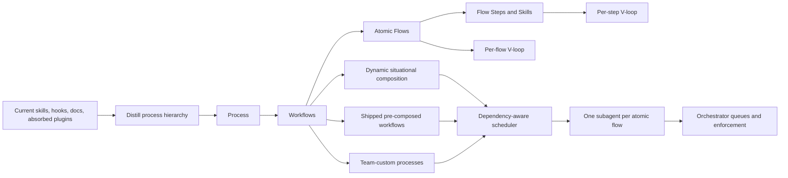
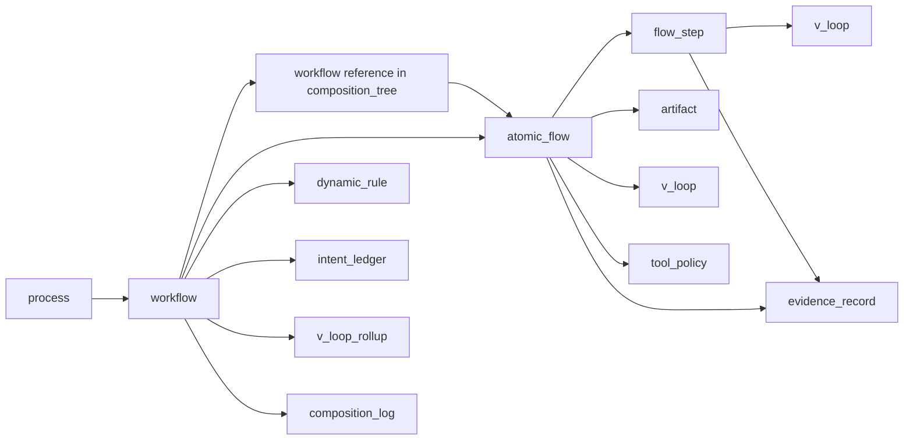

# SB Atomic Flow Redesign Plan

## Goal

Rebuild SB’s architecture so the product model is truly:




The pre-v0.48 18 FLOW aliases in `[docs/composable-flows-contracts.md](docs/composable-flows-contracts.md)` were too coarse: they were an SDLC spine, not the distilled basis of software-engineering and DevOps work. We will replace them with a minimal atomic-flow basis, then rebuild every composer, specialized workflow, runtime queue, and dynamic route from that basis.

SB’s conceptual hierarchy is:

1. **Process** — a team’s overall delivery process, e.g. “how this team ships software”.
2. **Workflows** — named paths inside that process, e.g. feature, bugfix, incident, release, deploy, content, test-hardening.
3. **Atomic flows** — meaningful reusable workflow units that represent fundamental software-engineering or DevOps capabilities.
4. **Flow steps / skills** — reusable instructions or checks that implement steps inside one or more atomic flows.

The APO differentiator is that SB can ship pre-composed workflows while also dynamically re-composing workflows at runtime. A pre-composed workflow is only a default process shape; the orchestrator may opportunistically omit, insert, or substitute atomic flows when the specific execution context makes that safer or leaner. This preserves process-oriented delivery without forcing ceremonial steps that add no value for the current instance.

The execution differentiator is that every atomic flow is a natural unit of delegated work: **one atomic flow must execute as exactly one subagent work package**. Workflows become dependency graphs of atomic-flow subagents. Independent atomic flows can run in parallel; dependent atomic flows wait for upstream V-gates. This lets SB exploit host-native concurrency mechanisms such as Cursor Multitask, Claude Workflows, Codex agent sessions, or future host scheduling features without inventing an unnatural parallelism model.

The V-model differentiator is that every atomic flow carries its own verification/validation loop. Each flow receives a need, desired outcome, requirement, specification, design, artifact, or context input; produces a work product; then verifies and validates that work product against the exact input that justified the flow. If verification fails, the flow loops agentically until the work product satisfies its V-gate or a documented blocker is escalated. Composed workflows inherit correctness because every component flow and flow step is locally verified.

References for the V-model framing:

- Wikipedia’s V-model summary distinguishes the left side as requirements/specification decomposition and the right side as integration plus verification/validation; validation asks whether we are building the right thing, verification asks whether we are building it right.
- SEI’s “Using V Models for Testing” stresses many short-duration V’s, testing/verifying work products as they are created, and the triple-V idea that tests and verification artifacts must themselves be verified to avoid false positives and false negatives.

The hard invariant is **no redundancy at any level** — enforced at atomic-flow, workflow, skill/step, and docs/runtime surfaces:

- **Atomic-flow level:** no two atomic flows may represent the same underlying software-engineering capability.
- **Workflow level:** no pre-composed workflow may duplicate another workflow’s semantics; shared sequences must become reusable workflows.
- **Skill/step level:** no skill may introduce an uncataloged workflow concept; it must either implement one atomic flow or compose existing flows.
- **Docs/runtime level:** docs, site pages, worker templates, hooks, orchestrator queues, and tests must derive from or validate against `docs/apo-catalog.json` — never duplicate catalog semantics or hand-author composition trees in prose or hardcoded tokens.

## Acceptance Criteria

This refactor is complete only when all of the following are true:

1. A machine-readable APO catalog is the authoritative source for processes, workflows, atomic flows, flow steps, artifacts, V-loops, tools, execution policies, dynamic rules, intent ledger, evidence records, V-loop rollups, and composition logs.
2. Every public workflow and specialized route decomposes into canonical atomic flows and reusable workflow components.
3. Every atomic flow has exactly one capability class; no two atomic flows duplicate the same concept.
4. Every mutable flow step/skill declares the atomic flow(s) it supports and its local input/output/V-check contract.
5. Every atomic flow has a V-loop contract: input, work product, verification, validation, repair, escalation, and evidence.
6. Every composed workflow has rollup semantics for child workflow, atomic-flow, and flow-step V-gates plus a final user-intent validation gate.
7. Dynamic workflow composition records all prune/insert/substitute decisions with catalog-backed reasons.
8. Opted-in tools are mandatory when relevant and produce required evidence or a catalog-defined failure outcome.
9. Team-custom processes can compose and override workflows without forking atomic flow definitions.
10. Every atomic flow maps to exactly one subagent work package with declared inputs, outputs, V-gate, dependencies, mutation scope, and merge/join behavior; non-dispatched inline checks belong at the flow-step/skill or declarative policy level, not as atomic flows.
11. Docs, site, tests, worker templates, agents, and plugin mirrors are generated from or validated against the catalog; workflow composition trees and composer matrices are never hand-maintained outside `docs/apo-catalog.json`.
12. Every flow step/skill has a per-step V-loop contract in the catalog before any runtime or skill-surface work depends on it; runtime join gates require step V-loops to execute and roll up before parent atomic-flow V-gates pass.
13. Intent ledger, evidence registry, V-loop rollups, and composition decision logs are first-class catalog entities with schema fields, producers, and consumers — not prose-only runtime behavior.
14. Every legacy GSD compatibility alias (`gsd-*` markers in hooks/config) and SB-owned lifecycle skill maps to exactly one canonical catalog entity; alias names may remain for compatibility only and must not retain parallel workflow or atomic-flow semantics outside `docs/apo-catalog.json`.
15. Every catalog entity sits at exactly one level in Process > Workflow > Atomic Flow > Flow Step/Skill; no entity may occupy multiple hierarchy levels.
16. Workflow nesting is expressed only via `workflow.composition_tree` and reusable-as-component references; there is no standalone catalog entity type for nesting — nesting is a property of workflows; `tests/scripts/test-apo-catalog-schema.sh` rejects any standalone nesting entity type.
17. No-redundancy is a hard invariant at atomic-flow, workflow, skill/step, and docs/runtime surfaces; deduplication gates and `tests/scripts/test-atomic-flow-nonredundancy.sh` block promotion or drift at any level.

## Non-Goals

- Do not make every skill an atomic flow.
- Do not preserve confusing public commands solely for compatibility; breaking cleanup is allowed.
- Do not let Bash hooks become the place where workflow intelligence lives.
- Do not treat pre-composed workflows as mandatory ceremony when runtime evidence allows a leaner dynamic composition.
- Do not weaken V-gates to “agent says done”; verification must have inspectable evidence.

## Design Decisions

- Atomic flow granularity: **fundamental capability units** in software engineering and DevOps. Not every skill becomes a flow; not only hook-enforced tokens count.
- Compatibility: **breaking cleanup allowed**. Existing `/silver:`* names can be renamed, removed, or demoted when the canonical model is clearer.
- Source of truth: `docs/apo-catalog.json` is the sole authoritative source for processes, workflows, atomic flows, flow steps, composition trees, and dynamic rules. Any composer matrix or workflow-tree markdown (`docs/composable-flows-contracts.md`, `docs/workflow-composition-matrix.md`, or companions) is **generated-only or validated as a rendered view** — never hand-maintained composition authority.
- Composition model: **hierarchical via workflow-as-component reuse** — not a separate catalog entity for nesting. Larger SDLC workflows compose smaller workflows (reusable-as-component) and atomic flows; nesting is a property of `workflow.composition_tree`, never a distinct catalog entity type.
- Redundancy policy: if two flows or workflows overlap, either merge them, split the shared part into a lower-level flow, or make one a named composition of the other.
- Skill model: skills are **flow-step implementations**, not automatically atomic flows. A skill can be shared by multiple atomic flows when the underlying step is genuinely common.
- Dynamic composition model: context-specific runtime composition may override a pre-composed workflow’s default shape, provided it still uses canonical atomic flows and records why a default atom was omitted, inserted, or substituted.
- Execution model: every atomic flow is a subagent work package; workflows are dependency graphs scheduled for maximum safe parallelism.
- V-model model: every atomic flow and every flow step has a built-in V-loop: input intent/specification → work product → verification/validation → repair loop.
- User-intent model: the top-level user prompt is the highest-level “need” on the left arm of the V. Final completion must validate that every material component of the user intent was satisfied.
- Tool policy: optional tools are opportunistic before opt-in, but follow the **once-opted-in-then-mandatory-when-relevant** policy after opt-in. Graphify, agentmemory, Aluminum, and future tools must use the same policy name and semantics in catalog `tool_policy` records.

## APO And V-Model Principles

SB should not be merely a catalog of commands. It should be a generic APO that can orchestrate and govern process execution for software engineering and DevOps.

Core principles:

1. **Processes are hierarchical workflows.** A team process is a composition of workflows; workflows compose atomic flows; atomic flows use flow steps/skills.
2. **Atomic flows are V-shaped.** Each atomic flow owns its local specification, work product, verification/validation, and repair loop.
3. **Every flow step is V-shaped.** A reusable skill/step must define its own expected input, output, verification mode, validation target, repair response, and escalation condition.
4. **Dynamic composition is first-class, context-sensitive, minimal, and auditable.** Pre-composed workflows are defaults, not ceremonies. The orchestrator may tailor the flow tree to the current context when catalog metadata proves a step is unnecessary or a missing step is required; every deviation is recorded in `composition_log` with catalog-backed rationale.
5. **No arbitrary composition.** Dynamic composition follows standard workflow composition patterns and software/DevOps-specific policies, not ad hoc model preference.
6. **Correctness composes.** If every flow and step has a sound V-loop and the workflow tree preserves dependencies, a complex process becomes a composition of verified simple units.
7. **LLM failure modes are explicitly countered.** Instruction loss, skipped intent, hallucinated completion, and weak evidence are caught by local V-gates plus final user-intent validation.
8. **Opted-in tools become process instruments.** Optional tools are not random enrichments once enabled; they become required evidence-producing instruments for flows where their capability is relevant.
9. **Atomic flows map to subagents.** The unit of atomic flow composition is also the unit of delegated execution; each atomic flow must run as exactly one subagent work package. Inline checks or evidence-only declarations are modeled as flow steps, skills, policies, or V-gate evidence, not as non-dispatched atomic flows.
10. **Parallelism follows dependencies.** SB should maximize parallel execution whenever atomic flows have independent inputs and non-conflicting outputs.

Workflow composition patterns to support:

- Sequence: A then B.
- Conditional branch: choose B or C based on context.
- Parallel branch: run independent flows and join on all gates.
- Loop: repeat a flow until V-gate passes or blocker escalates.
- Compensation: undo/rollback when a later flow invalidates prior work.
- Workflow-as-component: place a full workflow anywhere composition permits a reusable unit.
- Dynamic prune/insert/substitute: modify the default workflow tree using catalog-backed context rules.

Parallel execution rules:

- Build a dependency graph from workflow composition, flow prerequisites, artifact inputs/outputs, tool requirements, and mutation scopes.
- Dispatch one subagent per ready atomic flow.
- Use host-native concurrency where available: Cursor Multitask, Claude Workflows, Codex agent sessions, or equivalent host features.
- Join parallel branches only after each child atomic flow passes its V-gate (which requires all owned flow steps to pass their per-step V-loops and roll up first).
- Detect write conflicts through declared artifact/code scopes before dispatch.
- If a flow fails its V-gate, rerun that flow’s subagent loop or insert repair flows without invalidating unrelated passing branches.
- The parent orchestrator coordinates, schedules, records decisions, and enforces gates; it should not implement atomic-flow work inline.

## Opted-In Tool Governance

SB must keep optional tooling compatible with the APO model under the **once-opted-in-then-mandatory-when-relevant** policy:

- Before opt-in, tools such as Graphify, agentmemory, Aluminum, browser/e2e tools, cloud/DevOps providers, or external review providers are optional enrichments.
- After opt-in, the tool becomes mandatory for atomic flows whose contract declares that tool capability relevant.
- Mandatory does not mean always-on for every request; it means the orchestrator must evaluate relevance from the current context and either use the tool or record a catalog-backed reason why it is irrelevant.
- Tool outputs become V-model evidence. They can satisfy, challenge, or invalidate a flow’s verification/validation gate.
- Tool failures are blockers only when the tool is both opted in and relevant to the active flow. Otherwise they are warnings or skipped enrichments.
- The same policy must apply uniformly to Graphify, agentmemory, Aluminum, and future recommended tools.

Each tool integration needs:

- Config schema under `.silver-bullet.json` / template defaults.
- Activation/consent state.
- Relevance rules by atomic flow.
- Required evidence artifact or marker.
- Failure policy: warn, repair, block, or degrade.
- Named test `tests/scripts/test-opted-in-tool-enforcement.sh` (enforced in Phase 11) proving inactive, enabled-relevant, enabled-irrelevant, disabled, and failure-policy states.

## Declarative APO Schema

The authoritative representation should be a machine-readable catalog, likely under `docs/` or `templates/`, with generated or validated markdown views.

Candidate files:

- `docs/apo-catalog.schema.json` — JSON Schema for the catalog.
- `docs/apo-catalog.json` — authoritative catalog data.
- `docs/composable-flows-contracts.md` — **generated-only** human-readable reference; composition trees are read from `docs/apo-catalog.json`, not authored here.
- `docs/workflow-composition-matrix.md` — **generated-only** workflow tree view derived from catalog `workflow.composition_tree` fields; no hand-maintained composition authority.

Minimum entity model:




The `workflow reference in composition_tree` node above is a reference to an existing `workflow` entry, not a standalone entity type. Workflow nesting is represented only by `workflow.composition_tree` and reusable-as-component references.

Required schema fields:

- `process`: id, name, domain, default workflows, team override policy, mandatory gates.
- `workflow`: id, type, triggers, composition tree, reusable-as-component flag, allowed dynamic operations, final intent gate.
- `atomic_flow`: id, slug, capability class, trigger, prerequisites, inputs, work product, artifacts, V-loop, tools, owning skills, exit condition, and required `execution` block for its single subagent work package.
- `flow_step`: id, skill, purpose, inputs, outputs, V-loop (required per step: input contract, output contract, verification method, validation target, repair behavior, escalation condition, evidence), reusable-by flows.
- `artifact`: id, path pattern, schema/sections, producer, verifier, stale conditions.
- `v_loop`: verification methods, validation methods, evidence refs, repair loop, escalation rule, rollup target (flow, step, workflow, or intent).
- `evidence_record`: id, producer (flow, step, tool, or verifier), artifact/tool ref, sufficiency class, staleness key, satisfies V-loop ref.
- `intent_ledger`: material user-intent claims, mapped workflows/flows/steps, validation status, final gate result.
- `v_loop_rollup`: parent workflow/process gate aggregating child flow and step V-gate results plus intent-ledger coverage.
- `composition_log`: selected workflow, prune/insert/substitute ops, catalog rule refs, scheduler decisions, subagent dispatch/join records.
- `tool_policy`: tool id, opt-in state source, relevance rules, evidence, failure policy.
- `dynamic_rule`: prune/insert/substitute/parallelize/loop conditions and required rationale.
- `execution`: subagent prompt template, parallelizable flag, dependency inputs, mutation scopes, join conditions, retry policy, dispatch record shape, and merge/join behavior.

This catalog should be the single place where SB defines what is possible; hooks and docs should consume or validate against it.

The phase sections below describe workstreams; the `Implementation Order` section is authoritative for sequencing. Where there is tension, create the declarative schema skeleton before recording inventory rows so classification, hierarchy level, and alias-map fields are schema-backed from the first inventory pass.

## Phase 1: Inventory, Equivalence, And Classification

After the catalog schema skeleton exists, create a complete inventory of all process/workflow/flow/step surfaces:

- `[skills/](skills/)`: classify every `SKILL.md` as one of `flow-step-skill`, `atomic-flow-implementation`, `precomposed-workflow`, `process-router`, `reviewer-pack`, `quality-dimension-step`, `deprecated`, or `distribution-only`. Map every legacy GSD compatibility alias (`gsd-*` markers in hooks/config) and SB-owned lifecycle skill to exactly one canonical catalog entity each — no parallel semantics.
- `[docs/composable-flows-contracts.md](docs/composable-flows-contracts.md)`: mark current FLOW 1–18 as either retained atomic flows, split candidates, or macro lifecycle groups.
- `[.planning/DEPENDENCY-ABSORPTION-INVENTORY.md](.planning/DEPENDENCY-ABSORPTION-INVENTORY.md)`: use the absorption matrix to find capabilities currently hidden inside coarse flows.
- `[docs/sb-vs-as1.md](docs/sb-vs-as1.md)`: use the AS1 parity ledger to find capabilities currently represented as skills or domain packs but not canonical flows.
- `[hooks/lib/orchestrator-state.sh](hooks/lib/orchestrator-state.sh)`: inventory actual runtime queue atoms.
- `[templates/orchestrator-workers/](templates/orchestrator-workers/)`: inventory existing worker templates and gaps.

For every item, record:

- Underlying capability.
- Current skill/command/docs/hook surfaces that express it.
- Whether it belongs at process, workflow, atomic-flow, or flow-step/skill level.
- Equivalence class: which other items express the same capability.
- Proposed canonical flow, reusable workflow, or removal.
- Whether the capability is a required process invariant or a context-conditional atom.
- Its V-loop shape: input contract, work product, verification/validation method, repair loop, and escalation condition.
- Relevant opted-in tools and the evidence each tool may or must provide.

Deliverable: `.planning/ATOMIC-FLOW-DISTILLATION-INVENTORY.md` with a row for every relevant skill/capability, a recommended canonical disposition, and a GSD/SB-owned alias map (`gsd-*` hook/config markers and lifecycle skills → single catalog entity; no parallel semantics). This inventory is the input gate for `tests/scripts/test-canonical-alias-mapping.sh` (fully enforced in Phase 11).

## Phase 2: Implement The Declarative Catalog Skeleton

Before moving behavior, introduce the catalog schema and seed it with the current state.

Deliverables:

- `docs/apo-catalog.schema.json`
- `docs/apo-catalog.json`
- `tests/scripts/test-apo-catalog-schema.sh` — schema shape, required fields, and entity presence for `intent_ledger`, `evidence_record`, `v_loop_rollup`, `composition_log`, per-step V-loops, and required atomic-flow `execution` blocks; rejects any standalone nesting entity type (nesting only via `workflow.composition_tree` and reusable-as-component references).
- `tests/scripts/test-apo-catalog-sot.sh` — asserts `docs/apo-catalog.json` is the sole authoritative catalog file (no parallel catalog SOT).
- A temporary migration map from the current 18 FLOW IDs and current skill names into catalog entities.

The first catalog version can mirror current behavior, but it must already express the target hierarchy:

```text
process -> workflow -> workflow-as-component or atomic_flow -> flow_step
```

## Phase 3: Define The Minimal Atomic Flow Basis

Replace the old “18 lifecycle spine” model with a non-redundant catalog of fundamental atomic flows. Atomic flows must be larger than a single prompt/skill step, but smaller than a full workflow. Initial candidate groups:

- Entry and routing: `ROUTE`, `BOOTSTRAP`, `MIGRATE`, `ORIENT`, `CLARIFY`.
- Product and decision work: `RESEARCH`, `DECIDE`, `INGEST`, `SPECIFY`, `VALIDATE`.
- Planning and execution: `CONTEXT`, `PLAN`, `SPIKE`, `WORKTREE`, `TDD`, `EXECUTE`, `REFACTOR`.
- Review and quality: `REVIEW_REQUEST`, `REVIEW`, `REVIEW_TRIAGE`, `REVIEW_FIX`, `ARTIFACT_REVIEW`, `DOMAIN_AUDIT`, `QUALITY_GATE`.
- Verification and safety: `VERIFY`, `TEST_ENGINEERING`, `SECURE`, `AI_LLM_SAFETY`, `COMPLETION_AUDIT`.
- UI/design/content: `DESIGN_CONTRACT`, `UI_REVIEW`, `DESIGN_HANDOFF`, `CONTENT`.
- Ops and runtime: `BLAST_RADIUS`, `DEVOPS_ROUTE`, `DEPLOY`, `CANARY`, `INCIDENT`, `DEBUG`, `FORENSICS`.
- Knowledge and project management: `DOCUMENT`, `HANDOFF`, `KNOWLEDGE_CAPTURE`, `BACKLOG`, `PHASE_MANAGE`, `THREAD`, `UNDO`.
- Delivery and assessment: `SHIP`, `RELEASE`, `CREATE_RELEASE`, `RETRO`, `BENCHMARK`.

This is a working candidate list, not a final count. **No candidate may be promoted to a canonical `AF-*` catalog entry until it passes a blocking deduplication gate** recorded in the distillation inventory:

1. Equivalence review: map the candidate to an existing capability class; if covered, merge, split shared parts into a lower-level flow, or declare as a named workflow composition — never promote a duplicate.
2. Granularity review: reject promotion when the unit is only a flow step/skill or only a macro workflow group.
3. Usage review: reject orphan atoms not referenced by at least one pre-composed workflow, reusable workflow component, or dynamic router path.
4. V-loop review: reject promotion without a draft per-flow V-loop contract (input, work product, verification, validation, repair, escalation, evidence).
5. Step review: for every flow step the candidate would own or share, require a draft per-step V-loop contract before catalog write.

During implementation, each surviving candidate must also prove all of:

- It is a reusable capability unit, not merely a skill name.
- It is not merely a flow step that should remain a skill.
- It has clear triggers, artifacts, state impact, and exit conditions.
- It is not semantically covered by another atomic flow.
- It is used by at least one pre-composed workflow, reusable workflow component, or dynamic router path.
- It has one owning implementation surface, even if multiple skills contribute helper checks.

Deliverables:

- **Catalog write (authoritative):** add canonical `AF-*` IDs, slugs, contract fields, per-flow V-loops, per-step V-loops, and workflow `composition_tree` entries to `docs/apo-catalog.json` only. Phases 3–7 must not dual-author composition in markdown or skill prose.
- **Generated view:** rewrite `[docs/composable-flows-contracts.md](docs/composable-flows-contracts.md)` from catalog data (atomic flow schema, contract tables, migration map, runtime token mapping, hierarchy section, flow-step section, per-step V-loop table, equivalence notes). The composition matrix is emitted from catalog `workflow.composition_tree` — not hand-edited.

Each atomic flow contract must include:

- Input/need accepted by the flow.
- Work product produced.
- Verification method: inspection, analysis, demonstration, testing, artifact review, or command evidence.
- Validation method: how the work product is checked against user/team intent.
- Repair loop: what happens when verification/validation fails.
- Escalation rule: when the agent stops looping and reports a blocker.
- Opted-in tool policy: tool relevance, mandatory evidence when enabled, and fallback behavior when unavailable.
- Execution policy: subagent worker template, dependency edges, parallelization safety, mutation scope, merge/join behavior.

Named tests (blocking before Phase 8 runtime work):

- `tests/scripts/test-atomic-flow-dedup.sh` — every promoted `AF-*` has a deduplication gate record; no duplicate capability classes.
- `tests/scripts/test-atomic-flow-vloop.sh` — every catalog `atomic_flow` has a complete per-flow V-loop contract (input, work product, verification, validation, repair, escalation, evidence).
- `tests/scripts/test-flow-step-vloop.sh` — every catalog `flow_step` has a complete per-step V-loop contract.
- `tests/scripts/test-apo-composition-sot.sh` — workflow `composition_tree` entries exist only in `docs/apo-catalog.json`; generated markdown contains no composition authority drift.

## Phase 4: Define Artifacts, Evidence, And User Intent Ledger

Add the evidence model that makes the V-loops concrete and bind audit entities into the declarative catalog (not runtime-only logs).

Deliverables:

- Artifact registry in `docs/apo-catalog.json`.
- Catalog entities and schema sections for `intent_ledger`, `evidence_record`, `v_loop_rollup`, and `composition_log` with required fields, producers, consumers, and rollup semantics.
- User intent ledger model: material user-intent claims, mapping to workflows/flows/steps, and final validation status.
- Evidence sufficiency rules: what counts as inspection, analysis, demonstration, testing, artifact review, or tool evidence.
- Staleness rules: what edits invalidate what evidence.
- Test-verification rules: tests/reviews/audits are themselves work products and must be checked for false-positive/false-negative risk.
- `tests/scripts/test-apo-evidence-intent.sh` — intent-ledger coverage, evidence sufficiency classes, rollup linkage, and composition-log required fields.

The final completion gate must validate every material user-intent claim, not merely confirm that internal workflow steps ran.

## Phase 5: Build The Hierarchical Workflow Model

Define workflow hierarchy before rewriting individual composers.

Workflow levels:

1. **Process**: a complete team delivery system; may be default SB or custom team process.
2. **Workflow**: named path inside a process.
3. **Workflow as component**: any workflow may be reused inside another workflow when its input/output and V-gate contracts fit.
4. **Atomic flow**: indivisible workflow capability unit.
5. **Flow step / skill**: reusable implementation step shared by atomic flows.

Deliverable: every workflow `composition_tree` lives in `docs/apo-catalog.json`. A generated composer matrix (`docs/workflow-composition-matrix.md` or a section of `docs/composable-flows-contracts.md`) renders each workflow as a tree from catalog data only. There is no separate catalog entity for nesting; nesting is a property of workflows. **No phase 3–7 deliverable may introduce composition authority outside the catalog.**

Dynamic composition rule:

- Pre-composed workflows define the default tree.
- Team-custom processes may replace or reorder workflow branches.
- Runtime context may prune extraneous atoms, insert needed atoms, or choose a leaner reusable workflow when artifacts and state prove it is safe.
- Every runtime deviation must be explainable from catalog metadata: trigger absent, prerequisite already satisfied, risk level low, or user/team policy override.
- The orchestrator must prefer the smallest workflow tree that can satisfy the user intent and all applicable V-gates.
- Dynamic pruning is allowed only when the relevant V-loop can prove the omitted work is already satisfied or irrelevant.
- Dynamic insertion is required when a V-loop reveals an unsatisfied precondition, missing evidence, or unverified work product.
- If an opted-in tool is relevant to a selected atom, dynamic composition must include that tool step or record why the tool is irrelevant in this context.
- The scheduler must maximize safe parallelism by dispatching all dependency-ready atomic flows to subagents, subject to mutation-scope conflicts and host concurrency limits.

## Phase 6: Add Team Process Pack Model

Define how teams customize processes without forking SB’s atomic flows.

Deliverables:

- Process pack schema inside the APO catalog.
- Default SB SE/DevOps process pack.
- Team override rules: add/remove/reorder workflows, mandate gates, require tools, set risk thresholds.
- Conflict resolution: team policy vs user request vs runtime context.
- Versioning and migration rules for process packs.

Team process customization must compose existing atomic flows and reusable workflows defined in `docs/apo-catalog.json`. If a team needs a new atomic flow, that is catalog evolution, not local process drift. Process-pack overrides may reorder or gate workflows but must not introduce composition trees outside the catalog.

## Phase 7: Recompose All Pre-Composed And Customizable Workflows

Rewrite pre-composed workflow definitions in `docs/apo-catalog.json` so their `workflow.composition_tree` entries contain only ordered `AF-*` references, reusable workflow references, and conditional inserts; composer `SKILL.md` files must render or reference those catalog trees rather than becoming a second source of truth.

Primary composers to rebuild:

- `silver:feature`
- `silver:ui`
- `silver:devops`
- `silver:bugfix`
- `silver:deep-research`
- `silver:release`
- `silver:fast`

Promote, normalize, or remove specialized workflow skills where appropriate:

- `silver:incident`
- `silver:deploy`
- `silver:canary`
- `silver:content`
- `silver:retro`
- `silver:benchmark`
- `silver:refactor`
- `silver:test`

Because breaking cleanup is allowed, confusing aliases such as `silver-orient` vs `silver-scan` can be resolved by keeping only the clearer public route and updating docs/tests accordingly.

Deliverable: every composer `SKILL.md` has:

- `Standard composition chain` using only canonical flow IDs — **sourced from catalog `workflow.composition_tree`**, not hand-authored sequences.
- `Reusable workflows used` where a shared composition appears.
- `Conditional insertions` using only canonical flow IDs.
- `Dynamic composition policy` describing when the orchestrator may prune or insert atoms.
- `V-model coverage` describing the final user-intent validation, each flow-level V-gate, and **per-step V-loop references** (catalog `flow_step` IDs and their rollup into parent flow V-gates).
- `Enforcement queue` mapping to runtime tokens.
- No inline implementation procedure except routing/triage logic.
- No copied subsequence that appears in another composer; shared subsequences must be named workflows reused as components.

## Phase 8: Align Runtime Orchestrator And Workers

Update runtime to use the new catalog and subagent execution model:

- `[hooks/lib/orchestrator-state.sh](hooks/lib/orchestrator-state.sh)`: replace hardcoded old flow assumptions with canonical `AF-*` slugs and composer queues.
- `[templates/orchestrator-workers/](templates/orchestrator-workers/)`: one worker template per atomic flow; no orphan templates.
- `[hooks/workflow-chain-guard.sh](hooks/workflow-chain-guard.sh)`: align edit-admission markers with composer pre-execution flows.
- `[scripts/workflows.sh](scripts/workflows.sh)`: ensure Flow Log rows use canonical flow labels.

Generate derived views from `docs/apo-catalog.json` only (e.g. `docs/generated/atomic-flow-index.json` for hooks/tests). **Do not maintain a second authoritative catalog file**; derived views must be build artifacts with freshness tests proving they match the catalog SOT.

Add or update scheduler behavior:

- Build executable DAGs from workflow composition.
- Dispatch one subagent per atomic flow.
- Use host-specific multitask adapters where available.
- Preserve a parent-orchestrator-only rule: parent schedules and verifies, workers execute atoms.
- Record per-atom subagent IDs, inputs, outputs, per-step V-loop status, step-to-flow rollup status, atomic-flow V-gate status, retries, and join status.
- **Step-level V-loop enforcement (symmetric with flow-level):** worker execution and scheduler join gates must require every flow step's V-loop to execute and roll up into its parent atomic-flow V-gate before that flow's V-gate may pass; scheduling/join logic must not bypass step V-loops.

Runtime must also record dynamic composition decisions:

- Which pre-composed workflow was selected.
- Which atomic flows were pruned, inserted, or substituted.
- Why each deviation was allowed.
- Which team process policy, if any, shaped the final workflow.
- Which V-gate caused any repair loop, retry, or dynamic insertion.
- Which final user-intent checks passed before completion.
- Which opted-in tools were considered, used, skipped as irrelevant, failed, or blocked the flow.
- Which atomic flows were dispatched as subagents, which ran in parallel, and what dependencies/join gates controlled them.

Named tests (blocking before Phase 9 skill cleanup):

- `tests/scripts/test-subagent-execution-integrity.sh` — every atomic flow has exactly one worker/subagent handoff, one recorded subagent work package, and a recorded V-gate result.
- `tests/scripts/test-step-vloop-runtime-rollup.sh` — worker/join gates block atomic-flow V-gate until all owned step V-loops pass and roll up.
- `tests/scripts/test-parallel-scheduling-safety.sh` — independent atoms parallelize via host-native concurrency adapters when available; mutation-scope conflicts serialize with recorded rationale.
- `tests/scripts/test-dynamic-composition-audit.sh` — every prune/insert/substitute has a catalog rule ref in `composition_log`.
- `tests/scripts/test-triple-alignment.sh` — composer chains ↔ orchestrator queues ↔ workflow-chain guard markers.
- `tests/scripts/test-worker-template-parity.sh` — one template per `subagent` flow; plugin mirror matches.
- `tests/scripts/test-apo-derived-views.sh` — derived catalog views match SOT freshness.

## Phase 9: Skill Surface Cleanup

Classify and clean all skills (per-step V-loop contracts are already required in Phase 3 catalog write and Phase 4 evidence schema; this phase aligns `SKILL.md` prose to those contracts):

- Atomic flow implementation skills become guides for one canonical flow.
- Flow-step skills become reusable step instructions that may be called by several atomic flows.
- Every flow-step skill must mirror its catalog per-step V-loop contract: local input, output, verification method, validation target, repair behavior, escalation behavior, and evidence — drift from catalog is a test failure.
- Tool-backed skills must state their opt-in behavior and evidence contract; they must not silently degrade when enabled and relevant.
- Composer skills become pure composition specs.
- Review packs and quality dimensions become sub-capabilities referenced by `ARTIFACT_REVIEW`, `DOMAIN_AUDIT`, or `QUALITY_GATE` rather than standalone pseudo-workflows.
- Deprecated/duplicative commands are removed or redirected only if a transition note is needed.
- Agent bundles and plugin `skill-source` are regenerated from `[skills/](skills/)`.

This is where breaking cleanup happens: names that encode old plugin absorption history can be removed if the capability is represented cleanly elsewhere.

## Phase 10: Documentation, Site, And Distribution Sync

Update all user-facing surfaces to teach the new model:

- `[silver-bullet.md](silver-bullet.md)` and `[templates/silver-bullet.md.base](templates/silver-bullet.md.base)`.
- `[site/help/workflows/index.html](site/help/workflows/index.html)` and related help pages.
- `[site/index.html](site/index.html)` workflow/value sections.
- `[CHANGELOG.md](CHANGELOG.md)` when the refactor lands.
- Plugin mirror via `scripts/sync-codex-package.sh`, `scripts/sync-templates.sh`, and `scripts/generate-plugin-commands.sh`.

## Phase 11: Test Strategy And Gates

Add or update tests so drift cannot recur. Named deliverables for hard invariants (earlier phases seed subsets; this phase completes coverage):

| Invariant | Named test deliverable | First enforced |
|-----------|------------------------|----------------|
| Catalog SOT + schema | `tests/scripts/test-apo-catalog-sot.sh`, `tests/scripts/test-apo-catalog-schema.sh` — rejects any standalone nesting entity type; nesting only via `workflow.composition_tree` | Phase 2 |
| Composition-tree SOT (no dual-author) | `tests/scripts/test-apo-composition-sot.sh` — asserts every workflow tree in generated markdown/matrix matches `docs/apo-catalog.json` and no phase-3–7 file contains hand-authored `AF-*` composition sequences | Phase 3 |
| Per-atomic-flow V-loop contracts | `tests/scripts/test-atomic-flow-vloop.sh` — every catalog `atomic_flow` has input, work product, verification, validation, repair, escalation, and evidence | Phase 3 |
| Per-step V-loop contracts | `tests/scripts/test-flow-step-vloop.sh` | Phase 3 |
| Step V-loop runtime rollup | `tests/scripts/test-step-vloop-runtime-rollup.sh` — asserts worker/join gates block atomic-flow V-gate until all owned step V-loops pass and roll up | Phase 8 |
| Deduplication gate | `tests/scripts/test-atomic-flow-dedup.sh` | Phase 3 |
| Evidence + intent + rollups | `tests/scripts/test-apo-evidence-intent.sh` | Phase 4 |
| Non-redundancy (hard) | `tests/scripts/test-atomic-flow-nonredundancy.sh` — atomic-flow, workflow, skill/step, and docs/runtime surfaces | Phase 3 (catalog), Phase 11 (full surfaces) |
| GSD / SB-owned canonical mapping | `tests/scripts/test-canonical-alias-mapping.sh` — every `gsd-*` hook/config alias and SB-owned lifecycle skill resolves to exactly one catalog entity; no parallel semantics | Phase 1 (inventory), Phase 11 (hooks/skills/runtime) |
| Hierarchy integrity | `tests/scripts/test-apo-hierarchy-integrity.sh` — every entity at exactly one Process > Workflow > Atomic Flow > Flow Step level | Phase 11 |
| Skill classification | `tests/scripts/test-skill-hierarchy-classification.sh` — every `SKILL.md` has valid hierarchy level and only allowed catalog references | Phase 11 |
| Composer purity | `tests/scripts/test-composer-purity.sh` — composers reference only catalog flow IDs and named reusable workflows; per-step V-loop refs present | Phase 7 (catalog-backed), Phase 11 (full) |
| Dynamic composition auditability | `tests/scripts/test-dynamic-composition-audit.sh` — every prune/insert/substitute has catalog rule ref in composition log | Phase 8 |
| Subagent execution integrity | `tests/scripts/test-subagent-execution-integrity.sh` — every atomic flow has exactly one worker/subagent handoff, one recorded subagent work package, declared dependency and mutation scope metadata, and a recorded V-gate result | Phase 8 |
| Opted-in tool enforcement | `tests/scripts/test-opted-in-tool-enforcement.sh` — asserts inactive, enabled-relevant, enabled-irrelevant, disabled, and failure-policy states | Phase 11 |
| Parallel scheduling safety | `tests/scripts/test-parallel-scheduling-safety.sh` — independent atoms parallelize via host-native concurrency adapters when available; mutation-scope conflicts serialize with recorded rationale | Phase 8 |
| User-intent coverage | `tests/scripts/test-user-intent-coverage.sh` — final gate checks every material intent claim | Phase 4 (schema), Phase 11 (runtime) |
| Triple alignment | `tests/scripts/test-triple-alignment.sh` — composer chains ↔ orchestrator queues ↔ workflow-chain guard markers | Phase 8 |
| Worker template parity | `tests/scripts/test-worker-template-parity.sh` — one template per `subagent` flow; plugin mirror matches | Phase 8 |
| Router coverage | `tests/scripts/test-router-coverage.sh` — `/silver` routes map to pre-composed or dynamic catalog-backed composition | Phase 11 |
| Site/doc freshness | `tests/scripts/test-site-doc-freshness.sh` — public docs and generated matrix match catalog | Phase 10 |
| Derived view freshness | `tests/scripts/test-apo-derived-views.sh` | Phase 8 |

Assertion coverage:

- Catalog integrity: every `AF-*` has contract fields, worker status, owning skill, exit condition, and required `execution` block.
- Atomic-flow V-loop integrity (`test-atomic-flow-vloop.sh`): every `AF-*` has input, work product, verifier/validator, repair loop, escalation rule, and evidence.
- Step V-loop integrity (`test-flow-step-vloop.sh`): every catalog `flow_step` and every flow-step skill defines expected input, output, verification method, validation target, repair behavior, escalation behavior, and evidence.
- Non-redundancy (hard invariant): no two `AF-*` entries share the same capability class; no public workflow duplicates another without being declared as an alias or reusable workflow composition; no skill/step introduces an uncataloged workflow concept; docs/runtime surfaces contain no uncataloged workflow tokens; deduplication gate records exist for every promoted `AF-*`.
- GSD / SB-owned canonical mapping (`test-canonical-alias-mapping.sh`): every legacy GSD compatibility alias (`gsd-*`) and SB-owned lifecycle skill maps to exactly one catalog entity; hooks/config may retain alias names for compatibility only and must not define parallel semantics.
- Hierarchy integrity: every catalog entity sits at exactly one level in Process > Workflow > Atomic Flow > Flow Step/Skill.
- Skill classification: every `SKILL.md` has a valid hierarchy level and only allowed references.
- Composer purity: composers may reference only canonical flow IDs and named reusable workflows, not inline procedural steps.
- Dynamic composition auditability: every runtime prune/insert/substitute decision has a catalog-backed reason.
- Subagent execution integrity (`test-subagent-execution-integrity.sh`): every atomic flow has exactly one worker/subagent handoff, one recorded subagent work package, declared dependency and mutation scope metadata, and a recorded V-gate result.
- Step V-loop runtime rollup (`test-step-vloop-runtime-rollup.sh`): worker logs and join gates show step V-loop pass before parent flow V-gate pass; a failing step blocks flow V-gate.
- Parallel scheduling safety: independent atoms run in parallel via host-native concurrency adapters when available; conflicting atoms are serialized with recorded rationale.
- User-intent coverage: final completion checks every material part of the original user prompt against produced artifacts/evidence.
- Opted-in tool enforcement (`test-opted-in-tool-enforcement.sh`): inactive tools are optional; enabled-relevant tools produce required evidence or block/degrade per catalog failure policy; enabled-irrelevant tools record catalog-backed skip rationale; disabled tools are not invoked; failure-policy states (warn, repair, block, degrade) match catalog `tool_policy`.
- Triple alignment: composer chains ↔ orchestrator queues ↔ workflow-chain guard markers.
- Worker template parity: templates ↔ plugin mirror.
- Router coverage: `/silver` maps user intents to either a pre-composed workflow or dynamic flow composition.
- Site/doc freshness: public docs match the catalog and composer matrix.

Run at minimum:

- `bash tests/run-all-tests.sh`
- `bash scripts/validate-plugin-mirror.sh`
- Site freshness tests
- New atomic-flow catalog, hierarchy, and non-redundancy tests

## Phase 12: Release Plan

Because compatibility-breaking command cleanup is allowed, ship this as a minor or major release depending on final public command removals.

Release checklist:

- Full suite green.
- Help site updated and deployed.
- `CHANGELOG.md` documents renamed/removed commands.
- GitHub release highlights the new SB differentiator: canonical atomic flows plus pre-composed and dynamic composition.

## Implementation Order

1. Define the declarative APO schema (including audit entities, per-step V-loops, and required atomic-flow execution blocks).
2. Inventory and classify all skills/capabilities into equivalence classes.
3. Seed catalog with current behavior; run catalog SOT/schema tests.
4. Distill the minimal atomic-flow basis through the blocking deduplication gate; write per-flow and per-step V-loop contracts; run dedup, atomic-flow-V-loop, and step-V-loop tests.
5. Define artifacts, evidence, user-intent ledger, V-loop rollups, and composition-log schema; run evidence/intent tests.
6. Define reusable workflow components and generate the composer matrix from catalog `composition_tree` fields only.
7. Add team process pack model.
8. Update contracts and composers.
9. Update orchestrator/hooks/workers; generate derived catalog views only from SOT; run subagent-integrity and derived-view tests.
10. Align skill surfaces to catalog V-loop contracts and regenerate bundles/plugin surfaces.
11. Update docs/site.
12. Complete remaining drift, hierarchy, canonical-alias mapping, subagent execution, parallel scheduling, V-loop, tool-policy, and non-redundancy tests.
13. Run full suite, fix failures, commit, push, and prepare release notes.

## Risks

- Expanding the catalog too far could recreate skill sprawl. Mitigation: only promote reusable capability units with clear artifacts and triggers.
- Breaking command cleanup can surprise existing users. Mitigation: document removed/renamed routes clearly in the release notes and help site.
- Runtime and docs can drift. Mitigation: generate composer matrices and workflow trees from `docs/apo-catalog.json` only; enforce with `test-apo-composition-sot.sh` and `test-site-doc-freshness.sh`.
- Hooks may become over-strict if every flow becomes enforcement. Mitigation: distinguish composition flows from enforcement-required flows.
- Over-normalizing could hide useful user-facing workflows. Mitigation: allow rich pre-composed workflows, but require them to be hierarchical compositions rather than duplicated procedures.
- Building the schema too late could cause another prose-only refactor. Mitigation: introduce the machine-readable catalog before changing runtime behavior.
- Dynamic composition could become opaque. Mitigation: require an intent ledger and runtime composition decision log.
- V-loops could become ceremonial. Mitigation: every V-loop must name concrete evidence and repair behavior.

